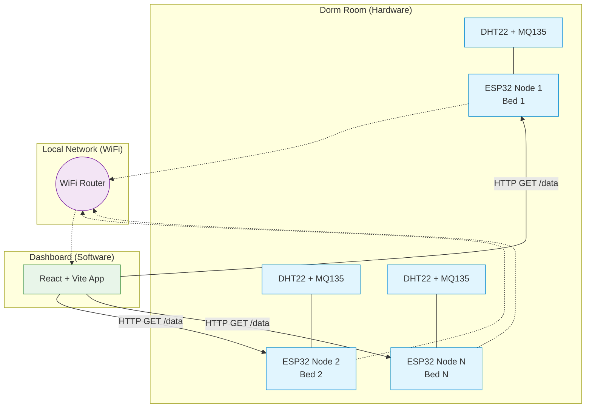

# System Architecture

The Dorm Climate System consists of three main components working together to collect, display, and analyze environmental data from a shared dorm room.

## 1. Hardware Layer (Firmware)
- **Microcontroller**: ESP32 for WiFi capabilities and analog/digital I/O.
- **Sensors**: DHT22 (Temperature & Humidity) and MQ-135 (Air Quality).
- **Behavior**: The ESP32 acts as an HTTP web server, responding to `GET /data` requests with a JSON payload containing the latest sensor readings.
- **Scalability**: The firmware is entirely generic. The physical placement and logical naming of the node (e.g. "Bed 1") is not hardcoded in the firmware.

## 2. Network Layer
- All ESP32 nodes and the device running the Dashboard must be connected to the same local WiFi network.
- Each ESP32 receives a local IP address (e.g., `192.168.1.X`).
- The dashboard communicates directly with the nodes using HTTP GET requests. There is no central cloud server required.

## 3. Application Layer (Software)
- **Frontend**: A React SPA (Single Page Application) built with Vite and TailwindCSS.
- **Configuration**: Users input the IP addresses and labels for however many nodes they have (supporting flexible room configurations like 4-sharing or 6-sharing).
- **Data Polling**: Custom React hooks (`useSensorData`) poll the configured IPs at regular intervals.
- **Visualization**: Data is displayed in real-time cards and historical charts using Recharts.
